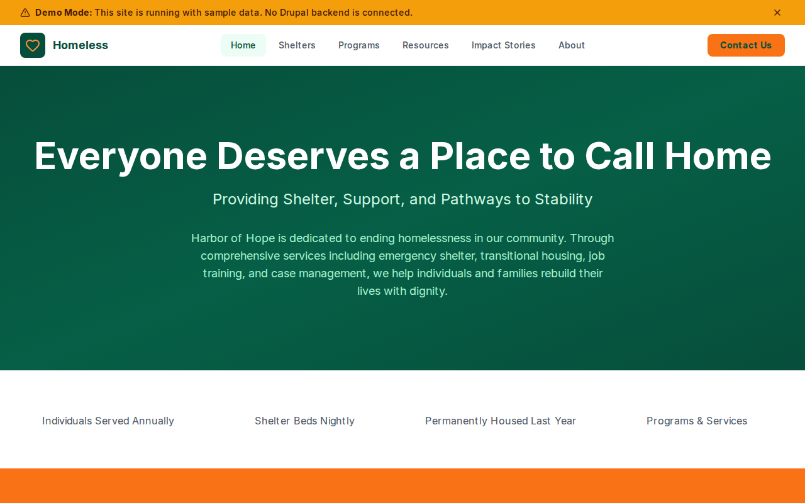

# Decoupled Homeless Services

A homeless services organization website starter template for Decoupled Drupal + Next.js. Built for shelters, outreach organizations, housing assistance agencies, and social service nonprofits.



## Features

- **Shelters** - Emergency, transitional, family, and youth shelter listings with capacity, hours, eligibility, and amenities
- **Programs** - Support programs including job training, housing first, and recovery services with schedules and contact info
- **Resources** - Community resource referrals for food, healthcare, legal aid, and more with provider details and availability
- **Impact Stories** - Success stories from individuals served, with quotes and program outcomes
- **Modern Design** - Clean, accessible UI optimized for social services content

## Quick Start

### 1. Clone the template

```bash
npx degit nextagencyio/decoupled-homeless my-homeless-services
cd my-homeless-services
npm install
```

### 2. Run interactive setup

```bash
npm run setup
```

This interactive script will:
- Authenticate with Decoupled.io (opens browser)
- Create a new Drupal space
- Wait for provisioning (~90 seconds)
- Configure your `.env.local` file
- Import sample content

### 3. Start development

```bash
npm run dev
```

Visit [http://localhost:3000](http://localhost:3000)

---

## Manual Setup

If you prefer to run each step manually:

<details>
<summary>Click to expand manual setup steps</summary>

### Authenticate with Decoupled.io

```bash
npx decoupled-cli@latest auth login
```

### Create a Drupal space

```bash
npx decoupled-cli@latest spaces create "My Homeless Services"
```

Note the space ID returned. Wait ~90 seconds for provisioning.

### Configure environment

```bash
npx decoupled-cli@latest spaces env 1234 --write .env.local
```

### Import content

```bash
npm run setup-content
```

This imports:
- Homepage with hero, stats (12,500+ individuals served, 850 shelter beds, 2,300 permanently housed, 40+ programs), and donation CTA
- 3 shelters: Harbor Main Emergency Shelter, Family Haven Shelter, New Directions Youth Shelter
- 3 programs: Job Training & Employment, Housing First Rapid Rehousing, Recovery & Wellness
- 3 resources: Community Food Pantry & Meals, Harbor Free Health Clinic, Legal Aid & Advocacy Services
- 3 impact stories: Marcus's Journey Home, A New Beginning for the DeShawn Family, Sarah's Path to Recovery
- 3 static pages: About Harbor of Hope, Get Help Now, Volunteer Opportunities

</details>

## Content Types

### Shelter
- **shelter_type**: Type taxonomy (Emergency Shelter, Transitional Housing, Family Shelter, Youth Shelter)
- **capacity**: Bed or unit count
- **address**: Physical address
- **phone**: Contact phone number
- **hours**: Operating and check-in hours
- **eligibility**: Who can access the shelter
- **amenities**: Available amenities (Meals, Showers, Laundry, Case Management, etc.)
- **image**: Shelter photo

### Program
- **program_category**: Category taxonomy (Housing Assistance, Job Training, Mental Health, Substance Recovery)
- **duration**: Program length
- **schedule**: Days and hours of operation
- **location**: Where the program is offered
- **contact_name**: Program contact person
- **contact_email**: Contact email
- **image**: Program photo

### Resource
- **resource_type**: Type taxonomy (Food Assistance, Healthcare, Legal Aid, Financial Assistance)
- **provider**: Organization providing the resource
- **phone**: Contact phone
- **website_url**: Provider website
- **address**: Physical address
- **availability**: Hours and days available
- **image**: Resource photo

### Impact Story
- **person_name**: Name of the individual (first name and initial for privacy)
- **program_participated**: Which program they used
- **quote**: Pull quote or testimonial
- **outcome**: Measurable outcome achieved
- **image**: Story image

### Homepage
- **hero_title**: Main headline (e.g., "Everyone Deserves a Place to Call Home")
- **hero_subtitle**: Tagline (e.g., "Providing Shelter, Support, and Pathways to Stability")
- **hero_description**: Introductory paragraph
- **stats_items**: Key statistics (individuals served, beds, housed, programs)
- **featured_items_title**: Section heading for featured programs
- **cta_title / cta_description**: Donation and volunteer call-to-action

### Basic Page
- General-purpose static content pages (About, Get Help, Volunteer, etc.)

## Customization

### Colors & Branding
Edit `tailwind.config.js` to customize colors, fonts, and spacing.

### Content Structure
Modify `data/homeless-content.json` to add or change content types and sample content.

### Components
React components are in `app/components/`. Update them to match your design needs.

## Demo Mode

Demo mode allows you to showcase the application without connecting to a Drupal backend.

### Enable Demo Mode

```bash
NEXT_PUBLIC_DEMO_MODE=true
```

### Removing Demo Mode

1. Delete `lib/demo-mode.ts`
2. Delete `data/mock/` directory
3. Delete `app/components/DemoModeBanner.tsx`
4. Remove `DemoModeBanner` from `app/layout.tsx`
5. Remove demo mode checks from `app/api/graphql/route.ts`

## Deployment

### Vercel (Recommended)
[](https://vercel.com/new/clone?repository-url=https://github.com/nextagencyio/decoupled-homeless)

### Other Platforms
Works with any Node.js hosting platform that supports Next.js.

## Documentation

- [Decoupled.io Docs](https://www.decoupled.io/docs)
- [Next.js Documentation](https://nextjs.org/docs)
- [Drupal GraphQL](https://www.decoupled.io/docs/graphql)

## License

MIT
